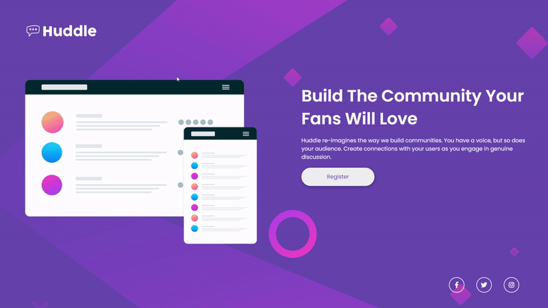

<h1 align="center">
  
</h1>
<p align="center">
  <a href="#-project">Project</a>&nbsp;&nbsp;&nbsp;|&nbsp;&nbsp;&nbsp;
  <a href="#-technologies">Technologies</a>&nbsp;&nbsp;&nbsp;|&nbsp;&nbsp;&nbsp;
  <a href="#-getting-started">Getting started</a>&nbsp;&nbsp;&nbsp;
</p>

<p align="center">
  <a href="https://www.linkedin.com/in/evertonpinheiroti/"></a>
  </a>
  
  <a href="https://github.com/TIEverton/huddle-challenge/stargazers">
    
  </a>
</p>

## 💻 Project

This is a solution to the [Huddle landing page with single introductory section challenge on Frontend Mentor](https://www.frontendmentor.io/challenges/huddle-landing-page-with-a-single-introductory-section-B_2Wvxgi0). Frontend Mentor challenges help you improve your coding skills by building realistic projects. 



## ✨ Technologies

This project was developed using the following technologies:

- [HTML]
- [CSS]

## 🔥 Preview

[Deploy with Github Pages](https://tieverton.github.io/huddle-challenge/)

## 🚀 Getting started

Clone the project and access the folder

```bash
$ git clone https://github.com/TIEverton/huddle-challenge.git && cd huddle-challenge
$ run the index.html
```
You can now view the file in your browser.

---

Done with ♥ by Everton Pinheiro 👋🏻 
